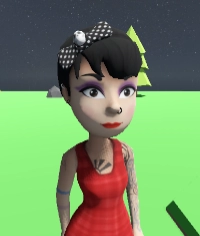

 

#
# Godot 3rd Person Game - Claire Scare!
*[Russ Painter](https://www.linkedin.com/in/geekymonkey/) @ [CoderDojo Ennis](https://coderdojoennis.com)*

This is an example [GODOT](https://godotengine.org/) v4.5 project with the following features:

* 3D Character exported from Mixamo along with a set of animations
* Simple 3rd person character controller
* 3rd person follow camera with mouse orbiting and obstacle avoidance

---

## Recipe to make something like this yourself

Follow along with these YouTube tutorials. If you're already familiar with Godot, then this can be completed in just a few hours.

### ⏹️ Basic Godot Introduction
*You can skip this section if you are already familiar with Godot*
* [How to make 3D Games in Godot](https://www.youtube.com/watch?v=ke5KpqcoiIU) by [Brackeys](https://www.youtube.com/@Brackeys)

### ⏹️ Mixamo Character and Animations -> Blender -> Godot
*Use the free Mixamo service to get a 3D character and animations, import these into Blender to convert to GLB format, and import into Godot and setup the animation player*
* [Using Mixamo characters in Godot 4 made easy](https://www.youtube.com/watch?v=j48WTY1w_Po)
by [Bluefever Software](https://www.youtube.com/@BlueFeverSoft)
* [Godot 4 + Mixamo = Stunning 3D Characters](https://www.youtube.com/watch?v=tU5yab-O6aM)
by [Bluefever Software](https://www.youtube.com/@BlueFeverSoft)

### ⏹️ 3rd Person Follow Camera
*Improve the 3rd person camera to orbit around the character with mouse movement and avoid obstacles*

* [Making a GOOD third person camera in Godot 4](https://www.youtube.com/watch?v=ZCb12AHKMfE)

## Extras

* Backwards walk animation (slower than forward walk)
* Punch attack animation
* Character eye blink animation
* VSCode setup for Godot scripting

## Potential Enhancements

* The initial idea was to make a Halloween themed game with a spooky environment and scary monsters.
* Sound FX and background music
* More animations - crouch, pain, die, etc.
* Code cleanup - Refactor input and movement into separate systems
